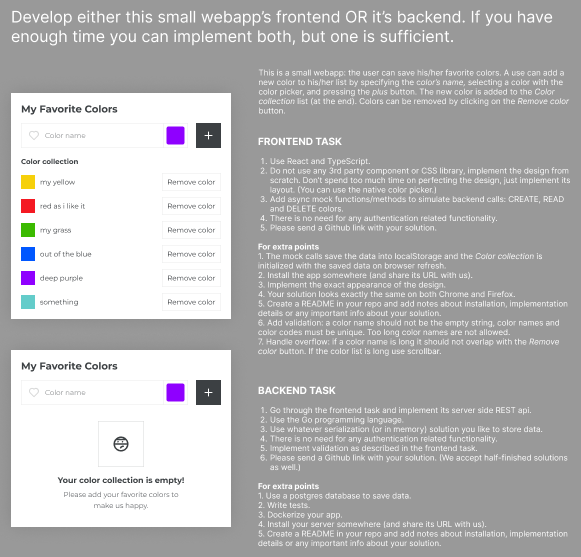
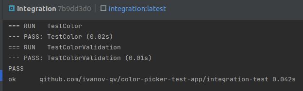

# Color picker test app
Backend of a simple app where the user can save his favorite color. It is an interview test task.

## It is deployed on Google cloud

Go to https://color-app-hznvjhuleq-no.a.run.app/user/1/color to fetch someone's favourite colors!

# Details

## Dockerized

The app is fully dockerized. You can see here 3 Dockefiles:
1. **Dockerfile** - for building local and staging versions of the app. Allows you to provide environment specific 
configs, builds extended version of an app using **-tags migrate** defined in the Makefile for seamless db migrations. 
2. **Dockerfile-prod** - for building production version. Uses minimal app version without staging functionality. 
Only uses production configuration.
3. **integration-test/Dockerfile** - for building another instance for running integration tests. 
Is a part of build described in docker-compose.yml. Ready to be used in CI/CD.

All the docker builds are staged. Final image uses scratch, which makes it lightweight - **11.61 MB**.

## Cloud native

The app is exposing **/healtz** probe, used by kubernetes for checking liveness of a container. 
In this case it is not necessary, but it is also possible to expose readiness and startup probes as well.

It makes this app ready to be running in kubernetes.

Also, cmd/main.go contains functionality to receive syscalls and make graceful shutdown.

## Clean architecture

Clean architecture pattern was used for development. This pattern allows to easily extend 
application functionality, make it flexible and easy to test.

## Endpoints

POST /user - create new user

POST /user/{id}/color - add color to a user

    {
        "name": "my happy color",
        "HEX": "#00000"
    }

GET  /user/{id}/color - get all the colors of the user

DELETE /user/{user_id}/color/{color_id}/ - delete color

It is restricted to add colors with the same name or the same color code. 
Also, "name" could be only 20 letters long and "HEX" could be only valid hex color format.

Integration tests, that checks those validators, are passed

Try this api yourself using **try-me.http**

## Run locally

1. clone this repo
2. make run-docker 

